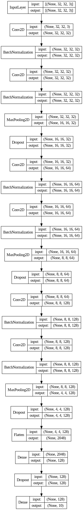
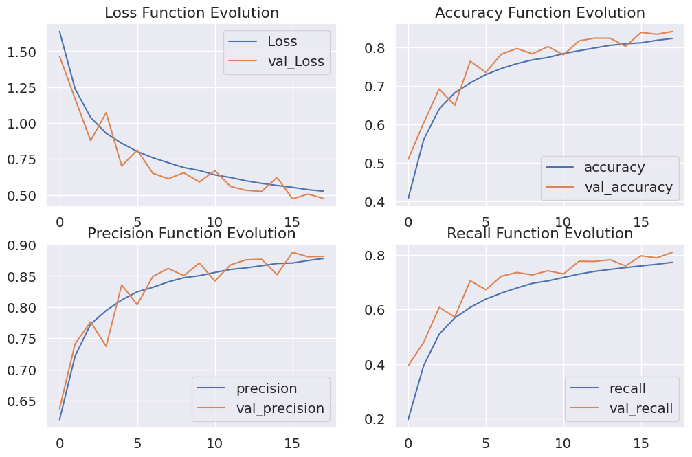

# CIFAR-10 Dataset Image Classification using CNN

[Dataset on kaggle](https://www.kaggle.com/datasets/fedesoriano/cifar10-python-in-csv)

## Contents
### Data Preprocessing
* Scaling
* Encoding

### Modeling
We use the following architecture for our model

### Model Improving
Here we use some techniques to avoid overfitting and increase the accuracy
* Early stopping
* Data augmentation

### Evaluation
We use precision, recall and accuracy as metrics in our model
* Classification report
* Confusion matrix
* Plotting

* 